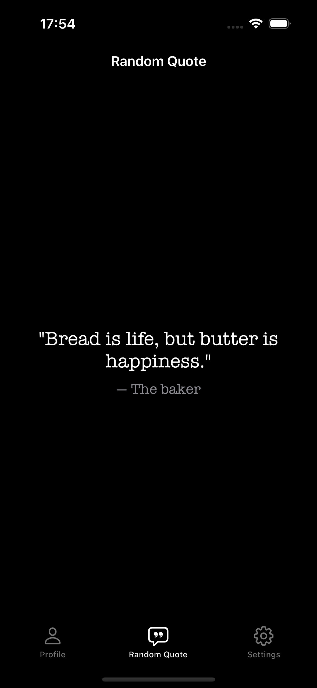
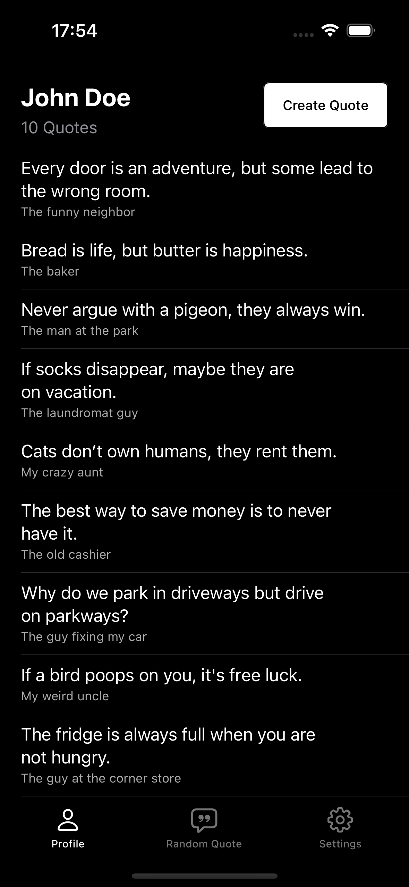
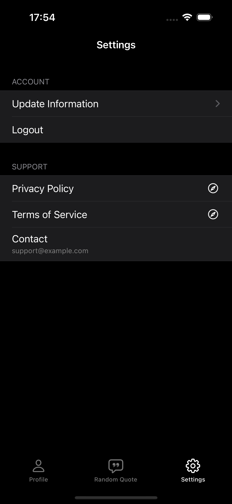
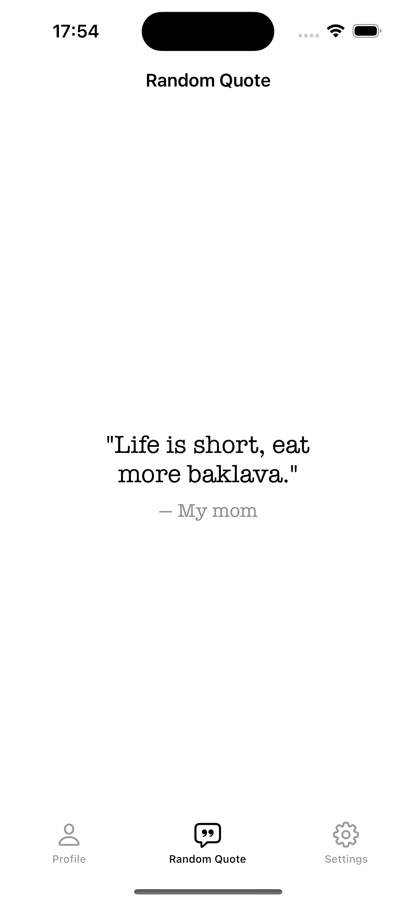
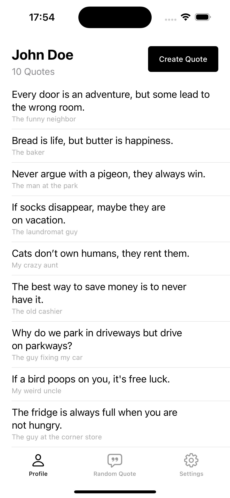
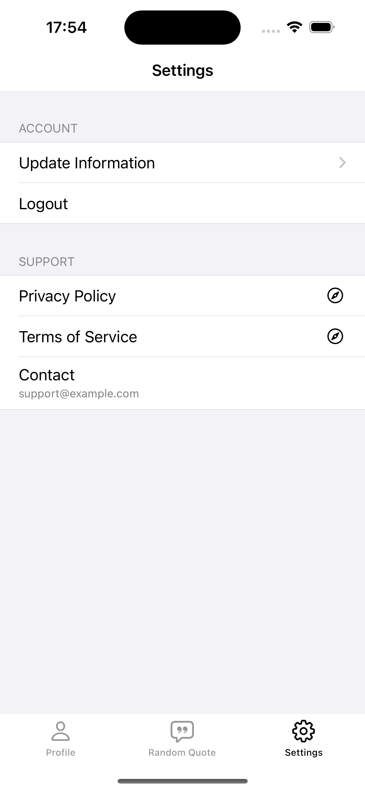
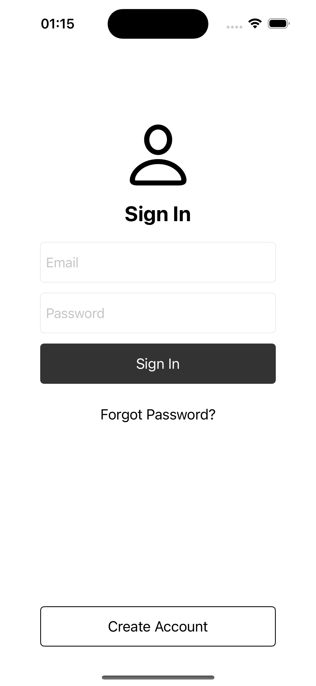
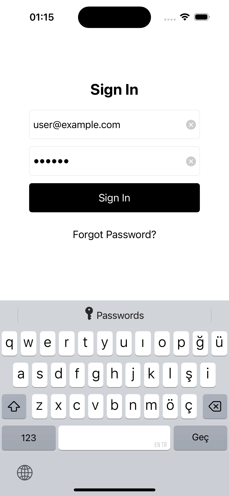

## Random Quotes App

### 1. Screens

1. **Dark Mode**

These are some `dark mode` screens.

For a more detailed view, please refer to the `light mode` section.

<div style="float: left;">
    
    
    
</div>

2. **Light Mode**

These are the `random quote`, `profile` and `settings` screens.

<div style="float: left;">
    
    
    
</div>

#### Auth

##### Sign In

<div style="float: left;">
    
     
</div>

### 2. Installation

1. **Clone the repository**

```sh
git clone https://github.com/otegecmis/random-quotes.git
```

2. **Navigate to the project directory**

```sh
cd random-quotes
```

3. **Open the Xcode project**

```sh
open RandomQuotesApp.xcodeproj
```

4. **Run the app**

Press the `Run` button in Xcode or use the shortcut `Cmd + R`.
